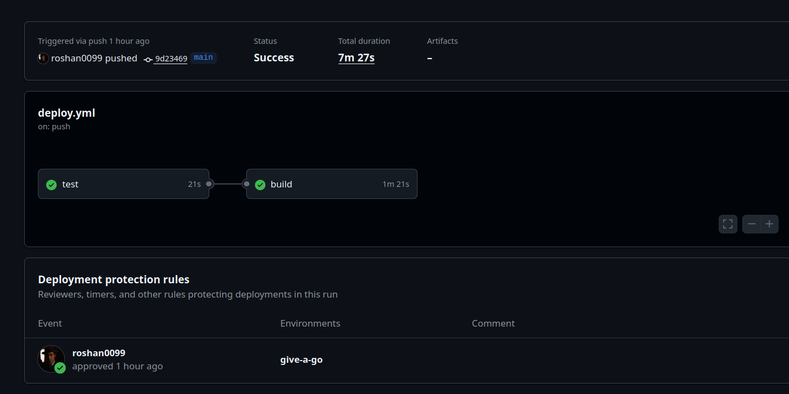
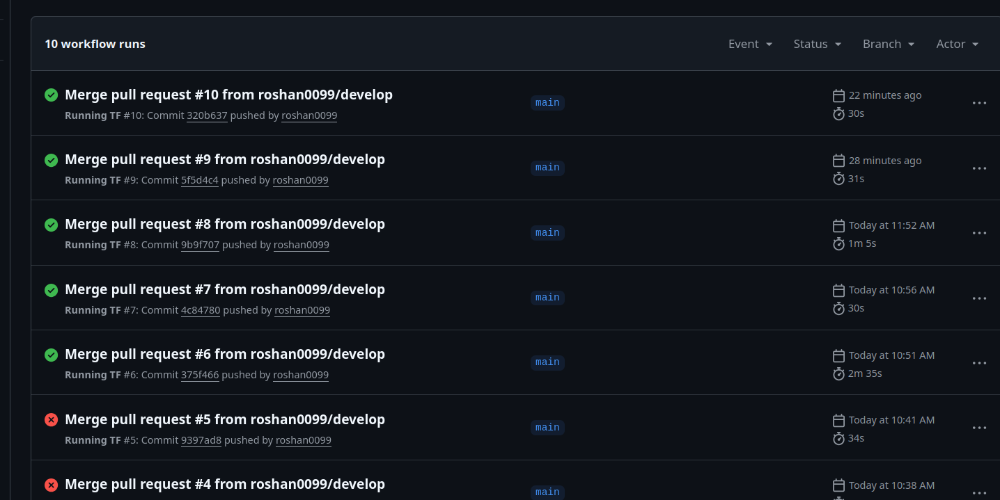
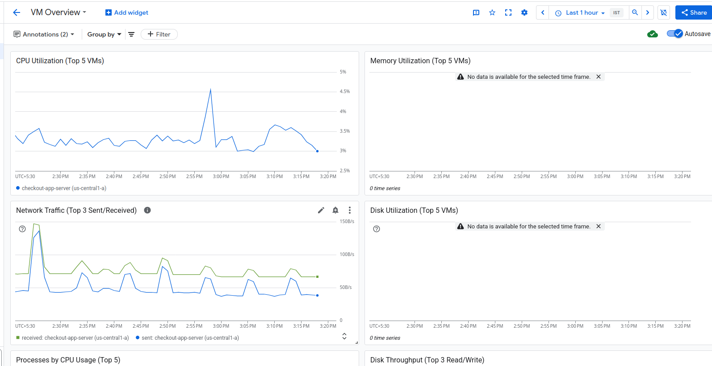
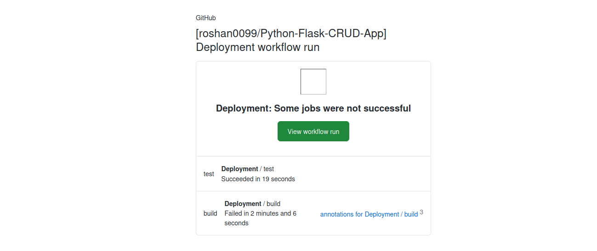
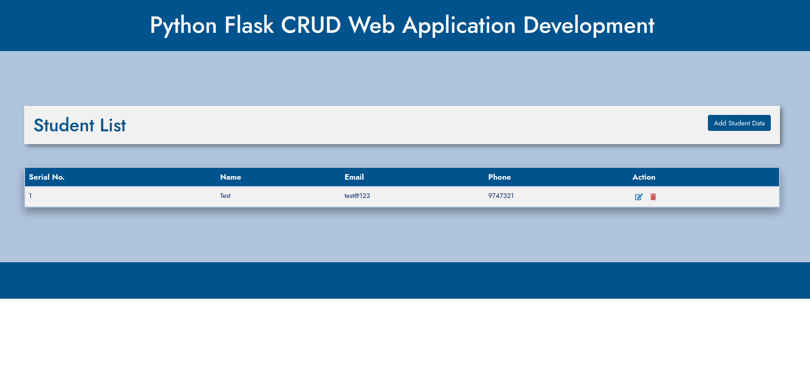

# Infra + Basic CRUD App

This repo mainly contains the infra for the project [FLASK-APP](https://github.com/roshan0099/Python-Flask-CRUD-App)

You can access the app [here](http://34.117.123.20/) for now 

The idea is to deploy a Basic Flask CRUD web application on GCP using:

- Terraform for Infrastructure as Code (IaC)

- Docker for containerization

- GitHub Actions for CI/CD automation

- Google Cloud Load Balancer for scalable traffic distribution

- Secret Manager for secure configuration management

- Github Email Notification to get alerted about the pipeline

The setup ensures automated deployment, security, and cost optimization.


# Architecture Overview

Components:

[Source Code](https://github.com/roshan0099/Python-Flask-CRUD-App): Flask application hosted on GitHub.

CI/CD: `GitHub Actions workflow builds Docker image -> pushes to Artifact Registry → Runs Test -> Manually deploy to the VM.`

## Infrastructure:

- GCP Compute Engine (VM) hosting Docker container

- HTTP Load Balancer pointing to backend instance group

- Secret Manager for credentials (DB)

- Secret variable in Github for CICD (Cred, Project ID etc)

- Firewall rules for controlled ingress (22, 80, 443)

- Added Dashbard to see the metrics

### Networking:

- VPC: checkout-vpc

- Subnet: Private and Public, but private is used wholly for the VM and CloudSQL 

- Load Balancer with health checks via port 80

FLOW :  `User → HTTP LB → Backend Service → Instance Group → Flask App (Docker)
`


# Setup Instructions
## Prerequisites

GCP Project with billing enabled

Terraform >= 1.8

Docker installed

GitHub repository with required secrets configured:

*   `GCP_PROJECT_ID`
*   `GCP_REGION`
*   `GCP_VM_NAME`
*   `GCP_VM_ZONE`
*   `GCP_SA_KEY`


### Infrastructure Deployment

```
cd terraform/env/prod
terraform init
terraform plan
terraform apply
```

This provisions:
```
    VPC, subnet, firewall

    VM instance (checkout-app-server)

    CLoudSQL (Backed Database)

    Instance group and Load Balancer (lb-backend-service)

```

### Application Deployment

For the repo please [refer](https://github.com/roshan0099/Python-Flask-CRUD-App)

The GitHub Actions workflow automatically:


- Test Job :

    This runs some basic tests on the code to make sure there is no broken packges and compilation issues

- Build Job:

    After manually approving

    Builds Docker image

    Pushes to Artifact Registry

    Access the VM using IAP Tunnel 

    Pulls and runs the container with the latest image in Artifact


### Accessing Secrets

Sensitive credentials and details are added to the Secret Manager and that is accessed through the secret.py 


### Cost Optimization

I have used micro variants of VM which is e2-micro and DB is db-f1-micro


### Validation

  VM endpoint is accessible through LB with port 80 and theres /health to check if the app is healthy 

  Additionally will add cloudfare to configure the ssl and as a proxy


## Some reference images

> Image showing manual build after test



> Pipelines



> VM Dashboard 



> Email Notification showing the pipeline result



> SS of Flask App

